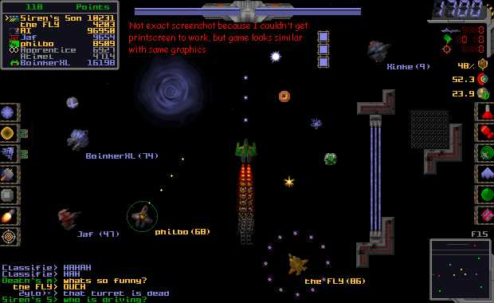

<div align="center">

## UPDATED \- A Subspace Replica


</div>

### Description

If you're lucky, you've played the game Subspace (aka Continuum) If not, download it. Well, this is the beginning of my attempt to copy it. Even though it isn't finished, this is a complete program. The reason I've uploaded it now is just to show some examples of trig algorithms for movement and BitBlt being used in a loop. For me, starting to use BitBlt inside a continuous loop was difficult at first because it can be tricky to get rid of the flickering. Anyway, here's my code and how I did it. Oh yeah, also has an example of GetAsyncKeyState, a good API to know.

UPDATE: Bombs, Bullets, Explosions, Enemies, Walls, Energy Bar. If you downloaded it already, dowload it again! The program has reached the point where it is too big to upload so if you want an up-to-date version, just email me.
 
### More Info
 
If you close it wrong, you will get a bit of memory leakage, not much though.


<span>             |<span>
---                |---
**Submitted On**   |2002-06-17 09:36:28
**By**             |[Chad Bjorklun](https://github.com/Planet-Source-Code/PSCIndex/blob/master/ByAuthor/chad-bjorklun.md)
**Level**          |Beginner
**User Rating**    |4.1 (29 globes from 7 users)
**Compatibility**  |VB 6\.0
**Category**       |[Games](https://github.com/Planet-Source-Code/PSCIndex/blob/master/ByCategory/games__1-38.md)
**World**          |[Visual Basic](https://github.com/Planet-Source-Code/PSCIndex/blob/master/ByWorld/visual-basic.md)
**Archive File**   |[A\_Subspace955186172002\.zip](https://github.com/Planet-Source-Code/chad-bjorklun-updated-a-subspace-replica__1-35467/archive/master.zip)

### API Declarations

```
Public Declare Function GetAsyncKeyState Lib "User32" (ByVal vKey As Long) As Integer
Public Declare Function BitBlt Lib "gdi32" (ByVal hDestDC As Long, ByVal X As Long, ByVal Y As Long, ByVal nWidth As Long, ByVal nHeight As Long, ByVal hSrcDC As Long, ByVal xSrc As Long, ByVal ySrc As Long, ByVal dwRop As Long) As Long
Public Declare Function LoadImage Lib "User32" Alias "LoadImageA" (ByVal hInst As Long, ByVal lpsz As String, ByVal un1 As Long, ByVal n1 As Long, ByVal n2 As Long, ByVal un2 As Long) As Long
Public Declare Function CreateCompatibleDC Lib "gdi32" (ByVal HDC As Long) As Long
Public Declare Function SelectObject Lib "gdi32" (ByVal HDC As Long, ByVal hObject As Long) As Long
Public Declare Function DeleteObject Lib "gdi32" (ByVal hObject As Long) As Long
Public Declare Function DeleteDC Lib "gdi32" (ByVal HDC As Long) As Long
```


